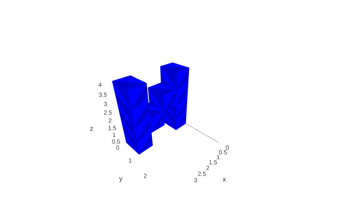

# voxviz
Visualize voxel images using Jupyter Notebooks and Plotly

An example:

[Interactive version of VoxViz.ipynb](https://nbviewer.jupyter.org/github/dillondaudert/voxviz/blob/master/VoxViz.ipynb)
